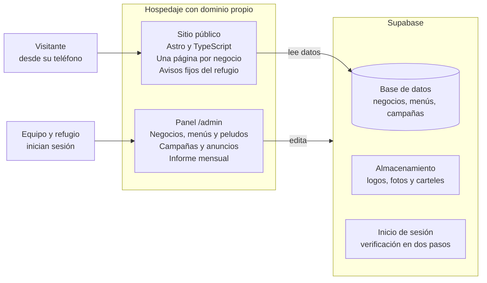
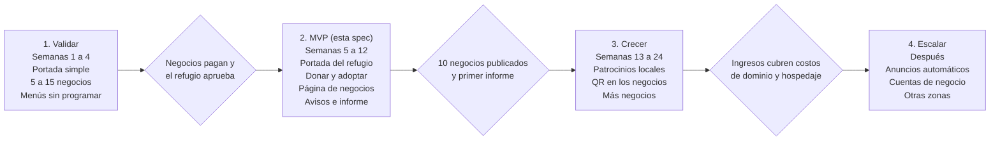

# Spec: sitio de Ladridos de Esperanza y colaboración "Come por los Peludos"

30 de septiembre de 2026

## Resumen y objetivos

El sitio tiene dos partes. La portada y sus páginas son 100% del refugio Ladridos de Esperanza (Tenancingo, Estado de México): quiénes son, lo que enfrenta un refugio, sus campañas de esterilización, las adopciones y cómo donar. Aparte, una página de colaboración llamada "Come por los Peludos" reúne a los negocios locales con su menú, horarios y promociones, como una forma de obtener recursos para el refugio. El [prototipo navegable](https://claude.ai/artifact/FiP8z2b1Drkpkn1eLdPgt6) muestra la portada del refugio y la página de colaboración con datos de ejemplo; los textos y cifras pendientes aparecen entre corchetes.

Objetivos del producto:

- Dar a conocer al refugio y lo que enfrenta a diario, con información clara y verificada por el propio refugio.
- Promover las campañas de esterilización y las adopciones responsables.
- Explicar la importancia de los donativos y facilitar donar, con transparencia sobre cómo se usan.
- Sumar negocios locales como colaboradores sin que tengan que hacer nada técnico: el equipo digitaliza su menú.
- Publicar cada mes cuánto se recibió y cuánto se gastó o entregó.

## Alcance

El MVP cubre la página del refugio (información, esterilización, adopciones y donativos), la página de colaboración con negocios y un panel para cargar contenido. Los pagos en línea y las cuentas de negocio quedan para una segunda versión. El MVP se lanza solo para Tenancingo, Estado de México.

**Dentro del MVP**

- Portada 100% del refugio: quiénes son, lo que enfrenta un refugio, esterilización, adopciones, donativos, transparencia y redes.
- Página de donativos con formas de donar, necesidades vigentes y en qué se usa el dinero.
- Página de campañas de esterilización, con cartel ampliable, preguntas frecuentes y próxima fecha.
- Carrusel de adopciones con fotos reales, favoritos locales y contacto por WhatsApp.
- Página de colaboración "Come por los Peludos": catálogo de negocios con búsqueda y filtros, y página propia por negocio con menú, horarios, ubicación, promoción y código QR.
- Barra fija discreta con enlaces a adopciones, esterilización y donativos en las páginas de colaboración.
- Formulario para que un negocio pida sumarse como colaborador.
- Panel de administración para editar contenido del refugio, negocios, menús, peludos, necesidades y campañas.
- Espacios publicitarios etiquetados como "Anuncio" y página mensual de transparencia.
- Diseño móvil primero, solo en modo claro, analítica básica y aviso de privacidad.

**Fuera del MVP (versión 2 o posterior)**

- Pagos en línea, pedidos a domicilio o reservaciones.
- Cuentas con inicio de sesión para que cada negocio edite su propio menú.
- Reseñas y calificaciones.
- Aplicación móvil nativa.
- Anuncios automáticos tipo AdSense: solo cuando haya tráfico suficiente.
- Varias ciudades y modo oscuro.

## Contenido de la página del refugio

La portada guía a la persona en este orden: conocer a los peludos que buscan familia, entender el problema, esterilizar y donar. El tono es honesto y cercano, con fotos reales de los animales y sin imágenes crudas de maltrato en la portada. Toda cifra o dato debe venir del propio refugio; los huecos entre corchetes los completa el refugio.

**Fuentes de contenido.** Las redes del refugio son la fuente principal de textos, fotos e historias: [Facebook](https://www.facebook.com/ladridos.esperanza.5/), [Instagram](https://www.instagram.com/ladridosdeesperanzatenancingo/), [Facebook de SOS Ladridos de Esperanza Tenancingo](https://www.facebook.com/p/Sos-Ladridos-de-Esperanza-Tenancingo-100067644922613/) y [TikTok](https://www.tiktok.com/@sos_ladridostenancingo). Estas redes bloquean la lectura automática, así que el equipo recopila el contenido a mano y el refugio lo autoriza antes de publicarlo. En el sitio se enlazan y no se incrustan, para que la página cargue rápido y no rastree a los visitantes.

### Estructura de la portada

| Orden | Sección | Qué comunica | Llamado a la acción |
| --- | --- | --- | --- |
| 1 | Presentación | Nombre, frase corta del refugio y foto real de sus perros, con huellas y figuras de perros y gatos flotando detrás | Quiero adoptar (principal) y Dona |
| 2 | Adopciones | Carrusel de los peludos disponibles | Quiero conocer a [nombre] |
| 3 | Quiénes somos | Historia, ubicación en Tenancingo, tiempo de trabajo, equipo y voluntarios [por confirmar] | Conocer al refugio en redes |
| 4 | Lo que enfrenta un refugio | Las problemáticas de la tabla siguiente, con cifras propias | Donar |
| 5 | Esterilización | Por qué esterilizar y próxima campaña | Reservar lugar |
| 6 | Donativos y otras formas de ayudar | Importancia de donar, en qué se usa, necesidades del mes, voluntariado, hogar temporal y compartir | Donar |
| 7 | Transparencia | Informe mensual de lo recibido y lo gastado | Ver informe |
| 8 | Colaboración con negocios | Explica "Come por los Peludos" en dos líneas | Ver negocios |
| 9 | Redes y contacto | Enlaces a las cuatro redes y WhatsApp | Seguir y escribir |

Entre una sección y otra hay un caminito animado de huellas (RF-31).

En el prototipo los datos pendientes aparecen entre corchetes y en cursiva. En el sitio real ningún texto entre corchetes se publica: una sección sin su dato confirmado se oculta o se muestra solo con su texto explicativo.

### Lo que enfrenta un refugio

Estas son las problemáticas que enfrentan los refugios en general. Antes de publicarlas, el refugio confirma cuáles aplican a su caso y aporta sus cifras: no se inventan ni se estiman datos, y una tarjeta sin dato propio se muestra solo con su texto explicativo.

| Problemática | Qué se explica en el sitio | Dato que aporta el refugio |
| --- | --- | --- |
| Abandono y maltrato | Animales que llegan abandonados, heridos o desnutridos, y casos que el refugio denuncia ante las autoridades. En julio de 2025 publicó en Facebook un caso de abandono y maltrato y presentó una denuncia ante la Fiscalía, según [la nota de Posta](https://www.posta.com.mx/edomex/hombre-arroja-a-perrito-a-jauria-que-lo-ataca-hasta-la-muerte-en-tenancingo-video/vl2062208) | Rescates por año [por confirmar] |
| Sobrepoblación | Camadas sin hogar y animales en la calle | Animales que recibe por mes [por confirmar] |
| Gastos veterinarios | Vacunas, desparasitación, cirugías, medicinas y urgencias | Gasto veterinario mensual [por confirmar] |
| Alimento y cuidados diarios | Comida, agua, limpieza y atención todos los días del año | Gasto mensual en alimento y número de animales [por confirmar] |
| Espacio limitado | Cada animal necesita espacio; cuando el refugio se llena, no puede rescatar a más | Capacidad y ocupación actual [por confirmar] |
| Enfermedades y emergencias | Animales enfermos o atropellados que necesitan atención inmediata | Casos de emergencia por año [por confirmar] |
| Adopciones lentas | Animales que esperan meses o años un hogar, y por qué la adopción debe ser responsable | Tiempo promedio de espera [por confirmar] |
| Pocos recursos y pocas manos | Dependencia de donativos y de voluntarios | Si recibe apoyo público y cuántos voluntarios tiene [por confirmar] |

Un caso de maltrato se cuenta sin imágenes crudas y con aviso de contenido sensible. No se publican nombres de personas denunciadas ni datos de procesos abiertos sin autorización del refugio.

### Campañas de esterilización

La esterilización es una de las formas más efectivas de reducir el abandono a largo plazo, porque evita camadas que después no encuentran hogar. El sitio la promueve en la portada, en una página propia y en los avisos fijos.

Los datos de la última campaña salen del cartel del refugio: sábado 26 de septiembre, costo de $380, en el propio refugio, desde las 9:30 am aproximadamente. Para reservar se paga en el refugio de 11:30 am a 1:30 pm o por transferencia pidiendo las cuentas por mensaje; los lugares son limitados y no son reembolsables en caso de inasistencia.

La página /esterilizacion incluye:

- Por qué esterilizar, en lenguaje sencillo y revisado por el veterinario del refugio.
- Datos de la próxima campaña: fecha, costo, lugar, horario, cupo, forma de reservar y política de no reembolso.
- Preparación antes y cuidados después, tal como los indique el veterinario del refugio [por confirmar].
- Cartel de la campaña ampliable.
- Botón "Reservar mi lugar" que abre WhatsApp con un mensaje prellenado.
- Fotos y resultados de campañas pasadas, si el refugio las comparte.

### Importancia de los donativos

El sitio explica, sin presionar, que el trabajo del refugio depende de quienes ayudan y en qué se convierte cada aporte. Falta confirmar con el refugio si los donativos son su principal fuente de recursos antes de afirmarlo en la página.

**Formas de ayudar**

- **Transferencia o depósito:** en el MVP, un botón abre WhatsApp para pedir los datos, como ya se hace con las campañas. Publicar una cuenta en el sitio requiere aprobación escrita del refugio.
- **Donativos en especie:** croquetas, medicinas, cobijas y artículos de limpieza, según una lista de necesidades vigentes que edita el refugio.
- **Apadrinar a un peludo** con un aporte mensual: opcional, se decide con el refugio.
- **Voluntariado y hogar temporal.**
- **Compartir** las publicaciones del refugio.
- **Comer en negocios colaboradores** de "Come por los Peludos".

**En qué se usa un donativo**

| Destino | Qué cubre | Equivalencia que define el refugio |
| --- | --- | --- |
| Alimento | Comida diaria de los animales | $[monto] = [cantidad] de comida |
| Atención veterinaria | Vacunas, desparasitación, medicinas y urgencias | $[monto] = [servicio] |
| Esterilizaciones | Campañas y apoyo a familias | $[monto] = [cantidad] de cirugías |
| Rescates y traslados | Transporte y primeros auxilios | $[monto] = [concepto] |
| Espacio y cuidado | Limpieza, reparaciones y camas | $[monto] = [concepto] |

El módulo "Necesidades del mes" muestra lo que hace falta ahora (tipo, urgencia y fecha de vigencia) y una necesidad vencida desaparece sola. La sección de transparencia publica cada mes los donativos recibidos y en qué se gastaron, con comprobantes.

## Usuarios y roles

En el MVP solo el equipo y el refugio inician sesión; los negocios piden cambios por WhatsApp o formulario y el equipo los aplica. El panel cubre los cambios menores (textos, fotos, horarios, precios, necesidades y campañas); los cambios grandes los hace el desarrollador en el código.

| Rol | Qué hace | Acceso |
| --- | --- | --- |
| Visitante | Busca negocios y platillos, consulta menús, conoce peludos y campañas | Público, sin cuenta |
| Negocio | Entrega su menú, logo y horarios; pide actualizaciones; aporta al refugio | Sin cuenta en el MVP |
| Refugio | Actualiza peludos en adopción, fechas y datos de campañas; revisa el reporte de aportes | Panel, solo sus secciones |
| Administrador | Digitaliza menús, gestiona negocios, solicitudes, anuncios y transparencia | Panel completo con verificación en dos pasos |

## Requisitos funcionales

Son 32 requisitos agrupados por módulo; cada uno tiene un criterio que permite decir si quedó terminado. RF-01 a RF-10 (catálogo y página de negocio) viven en la página de colaboración /colabora y no en la portada; RF-21 a RF-29 cubren la página del refugio y RF-30 a RF-32 la experiencia visual. El prototipo muestra RF-01 a RF-10, RF-13, RF-14, RF-21 a RF-28 y RF-30 a RF-32 como maqueta: esterilización, adopciones y donativos son secciones de la portada en lugar de páginas, los botones de WhatsApp son de ejemplo, nada se edita todavía desde un panel y los íconos de perro y gato están dibujados a mano (en el sitio real se sustituyen por los de una librería, RF-32).

| ID | Módulo | Requisito | Criterio de aceptación |
| --- | --- | --- | --- |
| RF-01 | Catálogo | Listado de negocios con tarjeta: nombre, categoría, estado abierto o cerrado, promoción y aporte al refugio | Cada negocio publicado aparece una sola vez y la tarjeta enlaza a su página |
| RF-02 | Catálogo | Búsqueda por nombre de negocio, categoría o platillo | Buscar "chilaquiles" devuelve los negocios que los tienen en su menú, sin distinguir mayúsculas ni acentos |
| RF-03 | Catálogo | Filtros combinables: categoría, abierto ahora, con promoción | Activar dos filtros muestra solo negocios que cumplen ambos; si no hay resultados, se explica cómo ajustar |
| RF-04 | Negocio | URL propia por negocio, por ejemplo /colabora/nombre-del-negocio | La URL se abre directamente, se puede compartir y cambia el título de la pestaña |
| RF-05 | Negocio | Menú por grupos y secciones, con precio, descripción y notas | Un menú de 150 o más platillos se navega por pestañas sin recargar la página |
| RF-06 | Negocio | Buscador dentro del menú | Escribir "latte" muestra solo los platillos que coinciden, con su sección |
| RF-07 | Negocio | Horarios por día, con cruce de medianoche y opción "por confirmar" | El estado "abierto ahora" es correcto a las 00:15 para un negocio que cierra a las 00:30 |
| RF-08 | Negocio | Ubicación con enlace "Cómo llegar" a un mapa | El botón abre el mapa con el nombre y la dirección del negocio |
| RF-09 | Negocio | Promoción visible en tarjeta y en la página | Una promoción vencida deja de mostrarse sin intervención manual |
| RF-10 | Negocio | Sección "Más negocios" al final de cada página | Muestra enlaces a los demás negocios publicados |
| RF-11 | Refugio | Adopciones: carrusel de peludos con foto, nombre, edad, tamaño y rasgos, y botón que abre el WhatsApp del refugio con mensaje prellenado (ver RF-30) | Al tocar un peludo se abre WhatsApp con su nombre en el mensaje |
| RF-12 | Refugio | Esterilización: última campaña, costo, lugar, horario, forma de pago, próxima fecha y cartel ampliable | Al publicar una nueva fecha, reemplaza "por anunciar" en todo el sitio |
| RF-13 | Refugio | Barra fija inferior y nota en cada página de /colabora con enlaces a adopciones, esterilización y donativos | La barra aparece en todas las páginas de /colabora, no cubre contenido y respeta el área segura del teléfono |
| RF-14 | General | Diseño móvil primero, solo modo claro | Todas las pantallas se usan en un teléfono de 360 px de ancho, sin desplazamiento horizontal y con botones de al menos 44 px |
| RF-15 | Altas | Formulario "Súmate" para negocios | Cada envío crea una solicitud visible en el panel, con aviso de privacidad aceptado |
| RF-16 | Panel | Edición de negocios, menús, horarios, promociones, peludos y campañas | Un cambio guardado se ve en el sitio público en menos de 1 minuto |
| RF-17 | Panel | Código QR por negocio que apunta a su página | El QR se descarga en PNG y en SVG |
| RF-18 | Anuncios | Espacios publicitarios etiquetados "Anuncio" | Todo anuncio muestra la etiqueta y se puede apagar sin tocar código |
| RF-19 | Transparencia | Página mensual con monto recaudado, monto entregado y comprobantes | El administrador publica el mes y el refugio puede revisarlo antes |
| RF-20 | Analítica | Visitas, búsquedas, clics a páginas de negocio, adopciones, esterilización y WhatsApp | Un tablero muestra estas métricas por semana, sin guardar datos personales |

**Página del refugio**

| ID | Módulo | Requisito | Criterio de aceptación |
| --- | --- | --- | --- |
| RF-21 | Portada | Presentación con foto real, frase del refugio y botones "Quiero adoptar" (principal) y "Dona" | La portada no muestra ningún negocio y los botones llevan a la sección de adopciones y a /donar |
| RF-22 | Portada | Sección "Quiénes somos" con historia, ubicación y equipo, editable desde el panel | El refugio cambia textos y fotos sin ayuda técnica |
| RF-23 | Portada | Sección "Lo que enfrenta un refugio" con una tarjeta por problemática y cifras propias | Cada cifra tiene fecha y fuente; una tarjeta sin dato muestra solo su texto explicativo |
| RF-24 | Esterilización | Página /esterilizacion con por qué esterilizar, datos de campaña, cartel, preguntas frecuentes y reserva por WhatsApp | Publicar la próxima fecha la actualiza en portada, página y avisos sin editar tres lugares |
| RF-25 | Donativos | Página /donar con formas de ayudar, en qué se usa el dinero y botón para pedir datos de depósito por WhatsApp | Ningún dato bancario se publica sin aprobación escrita del refugio |
| RF-26 | Donativos | Módulo "Necesidades del mes" editable, con tipo, urgencia y vigencia | Una necesidad vencida deja de mostrarse |
| RF-27 | Redes | Enlaces a las cuatro redes del refugio en encabezado y pie | Los enlaces abren en otra pestaña y las redes no se incrustan |
| RF-28 | Colaboración | Tarjeta en la portada que explica "Come por los Peludos" y lleva a /colabora | Un clic lleva al catálogo y el catálogo no se mezcla con la portada |

**RF-29, registro de cifras del refugio.** El panel incluye un registro sencillo donde el refugio anota cada mes los animales que recibe, rescates, adopciones, esterilizaciones y gastos. El refugio hoy no conoce estas cifras y es importante llevarlas: con ellas se alimentan las cifras de la portada y el informe de transparencia. Criterio: la portada solo muestra una cifra si tiene fecha y fuente, y un mes sin datos no se rellena con estimaciones.

**Experiencia visual**

| ID | Módulo | Requisito | Criterio de aceptación |
| --- | --- | --- | --- |
| RF-30 | Adopciones | Carrusel de peludos disponibles justo después de la presentación, con desplazamiento táctil, flechas, puntos de posición y avance automático. Cada tarjeta muestra foto (o ícono de perro o gato si no hay), nombre, edad, tamaño, dos rasgos y botón de contacto, y permite marcar un favorito solo en el dispositivo | Se maneja con el dedo, las flechas del teclado y los botones; se detiene al tocarlo o enfocarlo; no avanza solo con "reducir movimiento"; solo muestra peludos con estado "disponible" |
| RF-31 | Animación | Animaciones solo con CSS: caminito de huellas entre secciones, figuras de perros y gatos que flotan o se asoman, aparición al desplazar, corazón que late en "Dona" y huesos y huellas decorativos | Con "reducir movimiento" no hay ninguna animación; la página no salta mientras carga; no se usa ninguna librería de animación |
| RF-32 | Íconos | Un solo juego de íconos de una librería (perro, gato, hueso, huella, corazón y los de cada problemática) con el mismo grosor de trazo | Tres personas reconocen el perro y el gato a la primera; los íconos decorativos se ocultan a los lectores de pantalla |

## Modelo de datos

La pieza central es el menú, que tiene tres niveles (grupo, sección, platillo) porque el menú del café de ejemplo llega a más de 150 platillos. Los campos salen del prototipo; los marcados con asterisco se agregan para la versión real.

| Entidad | Campos principales |
| --- | --- |
| Negocio | id, slug, nombre, categoría, descripción corta, logo\*, dirección, latitud y longitud\*, teléfono o WhatsApp\*, estado (borrador, publicado, pausado)\*, porcentaje de aporte, fecha de alta\* |
| Categoría | id, nombre, orden |
| Grupo de menú | id, negocio, nombre (por ejemplo "Desayunos"), orden |
| Sección de menú | id, grupo, nombre, nota (por ejemplo "Precio caliente / frío"), orden |
| Platillo | id, sección, nombre, descripción, precio o precios con etiqueta, disponible, foto\* |
| Horario | id, negocio, día de la semana, hora de apertura, hora de cierre, nota; vacío significa "por confirmar" |
| Promoción | id, negocio, texto, fecha de inicio y fin\* |
| Peludo en adopción | id, nombre, especie, edad, tamaño, descripción, dos rasgos (etiquetas), fotos, orden en el carrusel, estado (disponible, en proceso, adoptado) |
| Campaña de esterilización | id, fecha, costo, lugar, horario, forma de pago, cupo, cartel (imagen), estado (próxima, pasada) |
| Anuncio | id, tipo (patrocinio local, automático), anunciante, texto, enlace, posición, vigencia |
| Solicitud de negocio | id, nombre del negocio, tipo, WhatsApp, fecha, estado (nueva, contactada, publicada, descartada), aceptó aviso de privacidad |
| Aporte mensual | id, mes, ingresos por fuente, monto entregado al refugio, comprobantes, publicado |
| Usuario del panel | id, nombre, rol (administrador, refugio), verificación en dos pasos |

**Entidades añadidas para la página del refugio**

- **Bloque de contenido:** id, sección, título, texto, imágenes, orden, publicado.
- **Problemática:** id, título, texto, cifra, fecha de la cifra, fuente, publicada.
- **Necesidad:** id, tipo (alimento, medicina, cobijas, limpieza, otro), descripción, urgencia, fecha de vigencia.
- **Enlace de red social:** id, red, URL, orden.
- **Registro mensual de cifras:** id, mes, animales recibidos, rescates, adopciones, esterilizaciones, gasto por concepto, notas.
- **Campo es_ejemplo** en todas las entidades: marca los datos de ejemplo (siguiente apartado).

**Datos de ejemplo (mock) para desarrollo**

Mientras el refugio entrega sus datos reales, el sitio se construye con datos de ejemplo que se sustituyen después sin cambiar el código. Cada registro lleva el campo es_ejemplo: en el sitio real nunca se publica un registro marcado como ejemplo, y en desarrollo se muestra una cinta con el texto "Datos de ejemplo".

| Dato | Ejemplo para desarrollo | Quién lo sustituye |
| --- | --- | --- |
| WhatsApp del refugio | Número ficticio | Refugio |
| Peludos en adopción | 6 registros con nombre, edad y tamaño inventados, y las fotos reales disponibles | Refugio |
| Próxima campaña de esterilización | Fecha y cupo ficticios, con el costo y el lugar del cartel anterior | Refugio |
| Café | Menú real de más de 150 platillos; nombre, dirección y horario ficticios | Negocio |
| Otros negocios | 4 negocios ficticios con menús cortos | Equipo, luego negocios reales |
| Necesidades del mes | Croquetas, medicinas y cobijas, con vigencia ficticia | Refugio |
| Cifras de problemáticas | Números ficticios, con etiqueta visible de ejemplo | Refugio |
| Informe de transparencia | Un mes ficticio con montos inventados | Refugio |

## Páginas y navegación

El sitio tiene 9 rutas. La portada y las páginas del refugio no muestran negocios: los negocios viven bajo /colabora. En el prototipo actual todo vive en un solo archivo: la colaboración y cada negocio usan rutas con # (#/colabora y #/colabora/1), y esterilización, adopciones y donativos son secciones de la portada. En la versión real cada página necesita una URL propia para que Google y las redes sociales puedan indexarla y compartirla.

| Ruta | Contenido |
| --- | --- |
| / | Portada del refugio: presentación, carrusel de adopciones, quiénes somos, lo que enfrenta un refugio, esterilización, donativos y otras formas de ayudar, transparencia, colaboración con negocios y redes |
| /esterilizacion | Por qué esterilizar, datos de la próxima campaña, cartel, preguntas frecuentes y reserva por WhatsApp |
| /adopta | Peludos disponibles, cómo es el proceso y contacto |
| /donar | Importancia de donar, formas de ayudar, necesidades del mes, en qué se usa el dinero y botón para pedir datos de depósito |
| /transparencia | Informe mensual de donativos y aportes de negocios |
| /colabora | "Come por los Peludos": catálogo de negocios colaboradores con búsqueda y filtros |
| /colabora/{slug} | Página del negocio: logo, menú con pestañas y buscador, horarios, ubicación, promoción, aporte y más negocios |
| /colabora/sumate | Formulario para que un negocio pida sumarse |
| /admin | Panel de gestión con inicio de sesión |

En las páginas de /colabora se mantiene una barra fija inferior con tres enlaces discretos (adopta, esterilización y donativos) y, en la página de cada negocio, una nota suave en la columna lateral. En las páginas del refugio no hace falta esa barra porque ya son el contenido principal; ahí el botón "Dona" queda visible en el encabezado.

## Diseño y UI

El diseño es sobrio y se piensa primero para teléfono: neutros verdosos, un solo acento verde salvia y únicamente modo claro. El modo oscuro se descartó por ahora. Se pidió evitar colores llamativos, por eso el logo de cuatro colores que se envió primero no se usó como paleta.

| Token | Valor (modo claro) |
| --- | --- |
| Fondo | #F3F5F2 |
| Superficie (tarjetas) | #FFFFFF |
| Texto | #1F2622 |
| Texto secundario | #596560 |
| Líneas | #DCE3DE |
| Acento (botones, enlaces, selección) | #3F6B58 |
| Texto sobre acento | #FFFFFF |
| Fondo suave (avisos, portadas de tarjeta) | #E4EEE8 |
| Texto sobre fondo suave | #284536 |

**Tipografía:** Bricolage Grotesque para títulos y DM Sans para texto, ambas de Google Fonts, con alternativas del sistema.

**Reglas de diseño**

- Móvil primero: la mayoría de las visitas vendrán de WhatsApp y redes, así que se diseña y prueba primero a 360 px de ancho y escritorio es una adaptación.
- Contraste de texto mínimo 4.5:1, foco visible con teclado y respeto a "reducir movimiento".
- Los avisos del refugio son discretos: barra delgada en gris, nota en fondo suave; nunca ventanas emergentes.
- Todo anuncio lleva la etiqueta "Anuncio" y un borde punteado para distinguirse del contenido.
- Contenido en español de México, precios en pesos mexicanos y horarios en formato de 24 horas o con am y pm de forma consistente.
- Logo del refugio: el oficial es el de cuatro cuadros con una forma distinta en cada uno (perro, hueso, huella y casita con S.O.S.). Se usa el archivo original en el encabezado, sobre fondo blanco; sus cuatro colores no se adoptan como paleta del sitio.

**Reglas móviles (base de 360 px)**

- Botones, chips y campos de al menos 44 px de alto; texto de campos de 16 px para que el teléfono no acerque la pantalla al escribir.
- Barra fija inferior de 48 px solo en las páginas de /colabora, con tres botones del mismo ancho ("Adopta", "Esteriliza" y "Dona"); en pantallas de 640 px o más muestra los textos completos.
- Menú de secciones y filtros en filas que se deslizan horizontalmente, sin ocupar varias líneas; el botón "Dona" queda siempre visible en el encabezado.
- Página de negocio: justo bajo el título van dos acciones rápidas, "Cómo llegar" y "Ver horarios", y las pestañas del menú quedan fijas al desplazarse.
- Una sola columna en teléfono; las columnas laterales pasan debajo del menú.
- Sin acciones que dependan de pasar el cursor por encima (hover).

**Íconos y animación**

- **Íconos:** de una librería existente, no dibujados a mano. Se recomienda [Lucide](https://lucide.dev/icons/paw-print), que incluye [paw-print](https://lucide.dev/icons/paw-print), [bone](https://lucide.dev/icons/bone), cat y dog, o Phosphor; verificar nombres y licencia al instalar. En el prototipo los íconos de perro y gato están dibujados a mano y el de perro se ve como si tuviera cuernos, por eso no se reutilizan.
- **Trazo y color:** todos con el mismo grosor de línea y en el color de acento, sin rellenos de otros colores.
- **Animación:** solo con CSS, y solo con transform y opacity para que sea fluida en teléfonos modestos. Entradas de 0.3 a 0.9 segundos; movimientos decorativos lentos de 3 a 7 segundos.
- **Límite:** pocas figuras en movimiento a la vez en pantalla, y nada se mueve sobre el texto que se está leyendo.
- **Reducir movimiento:** si el dispositivo lo pide, no hay animaciones ni avance automático del carrusel.
- **Accesibilidad:** los íconos y figuras decorativos llevan aria-hidden; los que son botones (favorito, flechas del carrusel) llevan etiqueta de texto.

## Arquitectura técnica recomendada

La recomendación es avanzar en dos pasos: validar con una herramienta sin programar mientras se consiguen los primeros 5 a 15 negocios, y pasar a un stack propio cuando el catálogo crezca. Dado que hay poco tiempo y casi nada de presupuesto, ambos caminos pueden empezar en planes gratuitos.

| Opción | Cuándo usarla | Ventajas | Límites |
| --- | --- | --- | --- |
| Sin programar (Softr o Glide sobre Airtable) | Primeras semanas, hasta unos 15 negocios | Se publica en días, el refugio puede editar datos | Menos control del diseño, menor posicionamiento en Google, los planes de pago suben con los usuarios |
| Stack propio (Astro con Supabase) | Desde que haya varios negocios y tráfico | URL propia e indexable por negocio, panel a la medida, diseño idéntico al prototipo | Requiere desarrollo y mantenimiento |

**Stack propuesto para la versión real**

- **Sitio público:** Astro con TypeScript y Tailwind CSS, con páginas generadas para que carguen rápido y se indexen bien.
- **Datos, cuentas y archivos:** Supabase (base de datos Postgres, inicio de sesión con verificación en dos pasos y almacenamiento de imágenes).
- **Hospedaje:** Vercel o Cloudflare Pages, con dominio propio.
- **Analítica sin cookies:** Plausible o Umami.
- **Mapas y contacto:** enlaces a Google Maps y a WhatsApp, sin integrar APIs de pago.
- **Códigos QR:** generados en el servidor a partir de la URL del negocio.

Visitantes y equipo entran por el mismo hospedaje; el sitio lee los datos y el panel los edita en Supabase, que también guarda las imágenes y las cuentas. Mapas, WhatsApp y analítica se integran con enlaces y un script sin cookies.

**Frontend: decisión y forma de trabajo**

El desarrollo lo hará una sola persona, desarrollador frontend, con apoyo de Claude para generar componentes, revisar código y redactar pruebas. Eso favorece un stack pequeño y fácil de mantener.

- **Framework:** Astro. Genera páginas casi sin JavaScript, que es lo que necesita un catálogo de contenido que debe cargar rápido en celular y aparecer en Google.
- **Lenguaje y estilos:** TypeScript y Tailwind CSS, con los colores del prototipo como variables CSS (un solo tema claro).
- **Interactividad:** componentes pequeños solo donde hace falta (búsqueda, filtros, pestañas y buscador del menú, carrusel de peludos hecho con scroll nativo de CSS), en Svelte o React.
- **Panel /admin:** una sección aparte con React y Supabase para iniciar sesión y editar datos.
- **Páginas por negocio:** generadas desde la base de datos, con etiquetas para compartir en WhatsApp y datos estructurados para Google.
- **Alternativa descartada por ahora:** Next.js. Es más pesado para un sitio de contenido; conviene reconsiderarlo si en la versión 2 se agregan cuentas de negocio con lógica compleja.
- **Punto de partida:** el prototipo HTML ya define la paleta, los componentes, la estructura de la portada del refugio y el comportamiento de búsqueda, filtros, menú por pestañas y avisos fijos; se traduce a componentes de Astro en lugar de empezar de cero.

**Requisitos no funcionales (objetivos propuestos)**

- Carga principal en menos de 2.5 segundos en un teléfono con conexión 4G.
- Accesibilidad nivel AA de WCAG 2.1.
- SEO: mapa del sitio, etiquetas para compartir en redes y datos estructurados de tipo negocio local en cada página.
- Copias de seguridad diarias de la base de datos.

## Ingresos, aporte al refugio y transparencia

Hay cuatro fuentes de recursos: los donativos directos y, de la colaboración con negocios, la digitalización de menús, los destacados y la publicidad. Los precios son una propuesta. Existen herramientas gratuitas para hacer un menú con QR, por ejemplo [Meniu](https://www.comparasoftware.com/meniu), así que lo que se cobra es el trabajo de digitalizar por el negocio y el respaldo de una causa local, no el software. Conviene probarlos con los primeros negocios y ajustarlos. Los primeros tres negocios, entre ellos el café de ejemplo, entran sin costo como piloto a cambio de su testimonio.

| Fuente | Cómo funciona | Precio propuesto |
| --- | --- | --- |
| Donativos directos | Personas que ayudan en efectivo, en especie o por transferencia; las campañas de esterilización también cuentan como donativo | Sin precio: hoy el refugio recibe efectivo y material de limpieza |
| Digitalización del menú | Pago único por crear y publicar menú, horarios, ubicación y QR, según el tamaño del menú | Chico (hasta 40 platillos) $350; mediano (41 a 100) $600; grande (más de 100) $900 MXN |
| Destacados y promociones | Mensualidad opcional para aparecer primero y publicar una promoción semanal | $150 MXN al mes |
| Patrocinio local | Anuncio etiquetado "Anuncio" en el catálogo y en las páginas de negocio | $300 MXN al mes |
| Anuncios automáticos | Solo cuando haya tráfico suficiente | Unos $20 MXN por cada 1,000 visitas (cifra conservadora y muy variable) |

**Reglas de aporte y transparencia**

- El porcentaje de los ingresos que va al refugio se define por escrito antes de publicar; el prototipo usa 50% como punto de partida.
- Cada negocio acuerda su propio aporte, que se muestra en su página.
- Cada mes se publica en /transparencia: ingresos por fuente, monto entregado al refugio y comprobantes.
- El refugio puede revisar el informe antes de que se publique y decide qué anuncios acepta.
- El dominio y el hospedaje los cubre el desarrollador como su donativo al refugio; no se descuentan de ningún ingreso.

## Operación: cómo se suma un negocio

Digitalizar un negocio sigue seis pasos, y el menú del café de ejemplo, que llegó como PDF, ya recorrió los pasos 2 y 3 en el prototipo.

1. **Contacto.** Se escribe al negocio por WhatsApp o redes sociales y se le ofrece el primer menú sin costo a cambio de su testimonio.
2. **Materiales.** El negocio entrega su menú (PDF o fotos), logo, horarios, dirección, contacto y permiso escrito o por mensaje para publicar.
3. **Digitalización.** El equipo captura el menú en el panel por grupos, secciones y platillos.
4. **Validación.** El negocio revisa precios y dudas de lectura antes de publicar. En el café hubo extras (cambios de leche y sabores con costo) que el PDF no permitía leer con certeza.
5. **Publicación.** Se publica la página y se entrega el QR para mesa o mostrador.
6. **Mantenimiento.** El negocio avisa por WhatsApp cuando cambian precios, horarios o promociones y el equipo actualiza.

Datos mínimos para publicar: nombre, categoría, dirección, al menos una sección de menú, autorización de publicación y porcentaje de aporte acordado. Un objetivo propuesto es tener el menú publicado dentro de 48 horas después de recibir los materiales.

## Seguridad, privacidad y aspectos legales

El sitio guarda pocos datos personales, pero maneja dinero de una causa, por lo que la confianza depende de hacer bien estos puntos desde el inicio. Esto no sustituye la opinión de un abogado o contador.

- **Acceso al panel:** cuentas individuales con verificación en dos pasos; el refugio solo ve sus secciones.
- **Datos personales:** solo nombre del negocio y WhatsApp de quien llena el formulario. Aviso de privacidad visible y aceptación explícita; conviene validarlo con un profesional según la ley mexicana de protección de datos.
- **Formularios:** límite de envíos por dispositivo y verificación contra spam.
- **Permisos de contenido:** autorización del negocio para publicar su menú, logo y fotos, guardada con fecha.
- **Fotos de animales y cartel:** confirmar con el refugio que puede publicarlas y que no incluyen personas identificables sin permiso.
- **Publicidad:** toda pieza etiquetada como "Anuncio"; el refugio puede rechazar anunciantes.
- **Dinero:** el refugio recibe el dinero directamente (donativos y pagos de negocios) y el sitio no lo procesa ni lo maneja. Falta saber si el refugio puede dar comprobantes.
- **Respaldos:** copia diaria de datos y de imágenes, con una persona responsable de restaurarla.

**Donativos y contenido del refugio**

- Ningún dato bancario se publica sin aprobación escrita del refugio; mientras tanto, los datos se piden por WhatsApp al número oficial.
- La página indica cuáles son los únicos canales oficiales para donar, para evitar fraudes que usen el nombre del refugio.
- No se publican nombres de personas denunciadas, datos de procesos abiertos ni imágenes de menores.
- Las imágenes de maltrato no van en la portada y llevan aviso de contenido sensible.
- Las redes se enlazan y no se incrustan, para no cargar rastreadores de terceros.

## Plan por fases e hitos

El plan propuesto tiene cuatro fases y tres puertas de decisión; el MVP que describe esta spec es la fase 2. Las duraciones son una propuesta y se ajustan con lo que se aprenda en cada puerta.

No se pasa a la fase siguiente sin cumplir el criterio de la puerta. Si la fase 1 no consigue negocios dispuestos a pagar, se corrige la oferta antes de construir el sitio completo.

## Métricas de éxito

Las metas son propuestas para el primer trimestre y se ajustan después de medir las dos primeras semanas.

| Métrica | Qué mide | Meta inicial propuesta |
| --- | --- | --- |
| Donativos recibidos al mes | Recursos directos para el refugio | Definir línea base con el histórico del refugio |
| Clics en "Dona" y solicitudes de datos por WhatsApp | Intención de donar | Medir desde el primer mes |
| Lugares de esterilización reservados con origen en el sitio | Efecto en campañas | Medir en la próxima campaña |
| Clics a adopciones | Interés en adoptar | Medir; revisar mensualmente con el refugio |
| Consultas de adopción por WhatsApp | Conversión real | Medir; comparar con consultas previas del refugio |
| Visitas mensuales | Alcance del sitio | Definir línea base en el primer mes |
| Negocios publicados | Avance de la colaboración | 10 en los primeros 30 días |
| Ingreso mensual de la colaboración con negocios | Viabilidad económica | Cubrir costos de dominio y hospedaje desde el mes 2 |
| Monto entregado al refugio | Impacto de la causa | Publicar el informe cada mes sin falta |

## Riesgos y preguntas abiertas

El mayor riesgo no es técnico: es conseguir negocios y mantener sus datos al día. Las preguntas abiertas de abajo bloquean partes concretas del desarrollo.

| Riesgo | Efecto | Mitigación |
| --- | --- | --- |
| Pocos negocios aceptan sumarse | Catálogo vacío, sin tráfico | Primer menú gratis, testimonios del café y del refugio, avance con 5 a 10 negocios antes de invertir en el sitio completo |
| Menús y horarios desactualizados | Pérdida de confianza | Fecha de última revisión visible, recordatorio mensual al negocio, canal de avisos por WhatsApp |
| Duda sobre el destino del dinero | Menos negocios y menos donaciones | Informe mensual con comprobantes, acuerdo por escrito con el refugio |
| Poco tráfico para anuncios automáticos | Ingreso bajo | No depender de ellos: priorizar digitalización y patrocinios directos |
| Dependencia de una sola persona | El proyecto se detiene | Documentar la operación y compartir acceso de administrador con una segunda persona del refugio |
| Derechos de imagen o de menú | Reclamos | Autorización guardada por cada negocio y por cada foto |

**Decisiones tomadas**

| Tema | Decisión |
| --- | --- |
| Logo | El oficial es el de cuatro cuadros con una forma distinta en cada uno |
| Nombre | El sitio se llama "Ladridos de Esperanza". "Come por los Peludos" se mantiene como nombre de la página de colaboración, aunque puede cambiar |
| Operación | Un panel de administración para cambios menores; los cambios grandes los hace el desarrollador en el código |
| Dinero | Lo recibe directamente el refugio; el sitio no lo procesa ni lo maneja |
| Dominio y hospedaje | Los cubre el desarrollador como su donativo al refugio |
| Precios | Los propone esta spec y se validan con los primeros negocios |
| Datos de ejemplo | WhatsApp, peludos, próxima campaña y datos del café se hacen con datos de ejemplo para completarlos después |
| Alcance geográfico | Solo Tenancingo, Estado de México |
| Contenido de las redes | El refugio autoriza usar todo: fotos, historias y cifras publicadas |
| Donativos actuales | Hoy el refugio recibe efectivo y material de limpieza; las campañas de esterilización también cuentan como donativo |

**Preguntas que siguen abiertas**

- [ ] Cifras del refugio: cuántos animales tiene y cuántos rescata y esteriliza por año. Hoy no las conoce; conviene empezar a llevarlas (RF-29).
- [ ] ¿Cuáles de las problemáticas de la portada aplican al refugio y qué cifra tiene cada una?
- [ ] ¿Quién revisa los textos sobre maltrato antes de publicarlos?
- [ ] ¿El refugio tiene cuenta bancaria para donativos y puede dar comprobantes? Hoy recibe efectivo y material de limpieza.
- [ ] ¿Cada negocio paga cuotas al refugio o aporta un porcentaje? Con el dinero yendo directo al refugio y sin gastos que descontar, hay que definirlo.
- [ ] Datos reales que sustituirán a los de ejemplo: WhatsApp, peludos, próxima campaña y datos del café.
